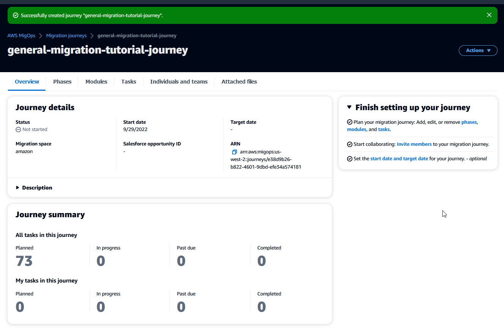
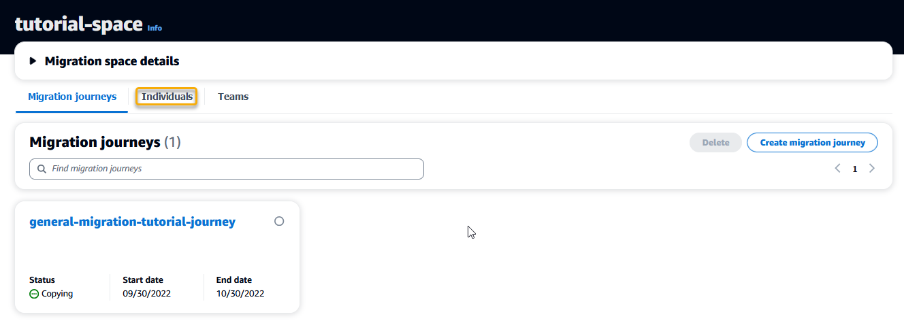
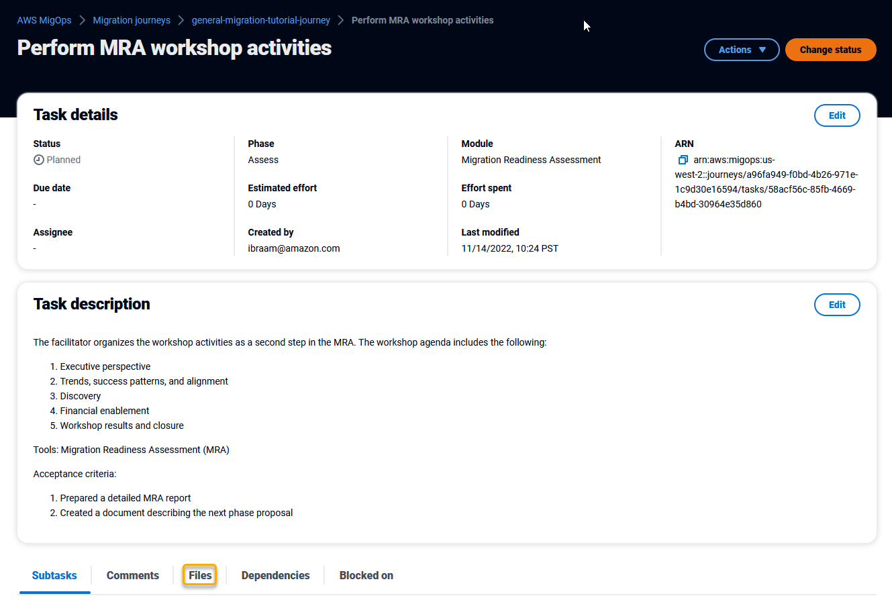
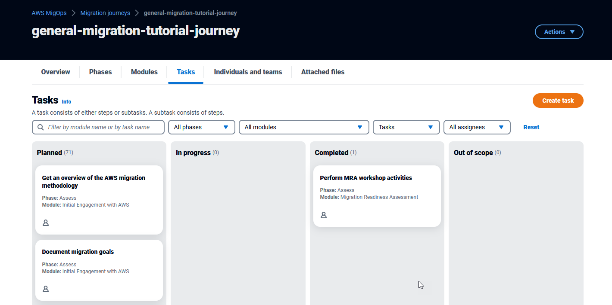

# Creating a migration journey from a template

In this tutorial you create a migration journey that uses the general migration template\. After you create the journey, you add and remove tasks to customize the journey\. You also send invitations to teams and individuals so that they can join the journey as members and work on it\. Finally, you set start and finish dates\.

**Create the migration journey**

1. In the navigation pane, choose **Migration journeys**\.

1. Choose **Create journey**\.

1. In the **Journey creation method** section, keep the default, which is **Use an AWS MigOps template**\.

1. In the **Journey details** section, under **Journey name** enter **general\-migration\-tutorial\-journey**\.

1. Under **Migration space**, choose **Create space**\.

1. In the **Space name** field, enter **tutorial\-space**\.

1. Under **Catalog of templates**, choose **General migration**\.

1. Choose **Create migration journey**\.

It might take MigOps up to a minute to create the journey for you\. The following image shows the journey overview that you see when the journey is ready\.

To finish setting up the journey, you invite team members to participate in the journey, then you edit its contents to match your specific migration scenario\. 

**Invite members**

In this procedure, you invite two people to join the migration space that you created while creating the journey\. 

1. In the navigation pane, choose **Migration spaces**\.

1. Choose the name of the **tutorial\-space** migration space\. This is the space that you created while creating the journey\. This will take you to the migration space's details page\.

1. On the details page, choose the **Individuals** tab that is shown in the following image\.  

1. Choose **Invite**\.

1. Enter the email address of a person that you want to work with you on migrations, then choose **Invite**\. This adds the person as a contributor to the migration space\.

1. Choose **Invite** again, and enter another email address to invite a second person to become a contributor to the migration space\.

1. In the navigation pane, choose **Migration journeys**\.

1. In the list of journeys, choose the name **general\-migration\-tutorial\-journey**\.

1. On the journey details page, choose the **Individuals and teams** tab that is shown in the following image\.   

1. Choose **Invite**\.

1. Use the drop\-down list labeled **Migration space individuals** to select an one of the two individuals that you had invited to the migration space\.

1. For **Role**, choose **JourneyContributor**\.

1. Choose **Invite**\.

1. Choose **Invite** again and repeat the previous step to invite the other individual that you had invited to the migration space\. For this individual, choose the role **JourneyAdmin**\.

**Customize the journey**

The general\-migration template includes tasks for performing a Migration Readiness Assessment \(MRA\)\. In this tutorial we imagine a scenario where you've already performed an MRA\. Therefore, the MRA tasks aren't needed\. In the following procedure, you delete the MRA tasks, and you attach your MRA report to the journey\.

1. Choose the **Tasks** tab that is shown in the following image\.   

1. Choose the task that is titled **MRA \- Review objectives and best practices**\.

1. On the task details page, choose the **Actions menu**, then choose **Delete** as shown in the following image\.  

1. In the dialog box, type **delete**, then choose **Delete**\.

1. Choose the task that is titled **Perform MRA pre\-workshop activities**\. This task has three subtasks\.

1. To delete a task, you must first delete all of its subtasks\. Choose the subtask that has the title **Pre\-workshop Questionnaire**\. On the subtask's details page, choose the **Actions** menu, then choose **Delete**\.

1. In the dialog box, type **delete**, then choose **Delete**\.

1. Go back to the **Pre\-workshop Questionnaire** task and delete its two remaining subtasks\.

1. Delete the **Pre\-workshop Questionnaire** task\.

1. On the journey's **Tasks** tab, choose the task that has the title **Perform MRA workshop activities**\.

1. On the task's details page, choose the **Files** tab as shown in the following image\.  

1. Choose **Choose file**, then upload your company's MRA report\. For this tutorial, you can upload any example file, even if it's an empty file\.

1. Go back to the journey's **Tasks** tab, and drag the **Perform MRA workshop activities** task to the **Completed** column as shown in the following image\.  

